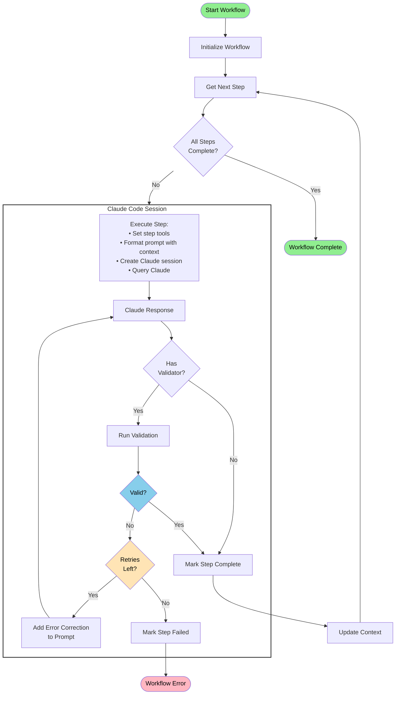
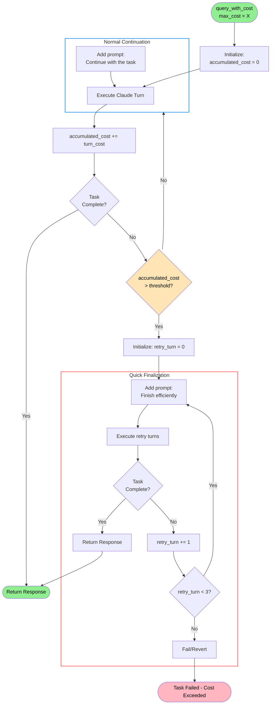

# Wake AI Architecture

The core component of Wake AI are workflows which consist of a set of steps. Each step has a prompt (with available tools) and a step validator. Options such as `max_cost_limit` or `max_retries` can be set for each step.

## Folder Structure

```
wake/
├── wake/cli/ai.py              # `wake ai` command implementation
├── wake/ai/                    # Core AI module
│   ├── claude.py               # Claude Code wrapper
│   ├── flow.py                 # Base workflow infrastructure
│   ├── prompts/
│       └── <prompt-name>.md    # Shared prompts files for workflows
│   ├── utils.py                # Shared utility functions
│   ├── runner.py               # Workflow execution helper
│   └── workflows/              # Workflow implementations
│       └── <workflow-name>.py  # Specific workflows implementations runnable from the CLI
│
└── wake_detectors/ai/audit/    # Detector wrapper
    └── detector.py             # AIAuditDetector class
```

## Execution Paths

Workflows can be implemented in 2 ways:

`wake ai --flow <name> <args>` - new CLI commands for running workflows

or

`wake detect <ai-detector-name> <args>` - standard detector wrapper for workflows

Both have their own advantages and disadvantages.

### 1. CLI Command: `wake ai`

```bash
wake ai --flow audit --scope contracts/Token.sol --model opus
```

This makes more (intuitive) sense, BUT:
- Wake is opensource and thus the prompts will be open-sourced too (at least at this point)

### 2. Detector Command: `wake detect`
AI workflow wrapped as a Wake detector.

```bash
wake detect ai-audit --scope contracts/Token.sol --model opus
```

Less intuitive for implementation, BUT:
- Can be created as a private detector, distributed within `wake-private`

## Workflow Core Concepts

### Cladue Session and Workflow Management

Wake AI contains inteligent wrappers for Claude Code API.
This wrapper allows us to:
- Continue `claude code` sessions inbetween steps
- Set cost limits for each step, where the wrapper automatically loops through `claude code` execution in configurable increments of `n` turns, monitoring accumulated costs after each increment and prompting Claude to efficiently finish the task when the specified `max_cost_limit` threshold is approached
- If a `validation` function is provided, the wrapper will automatically retry the step, prompting `claude code` to fix the errors returned by the `validation` function

### Working Directory

A key concept of Wake AI is the `working_dir` and `execution_dir`.
The `execution_dir` is the directory where the workflow is executed.
The `working_dir` is the directory where the `claude code` works in.

One of the main problems which needed to be resolved is how to pass context and results in between steps.
A straight forward solution is to simply use a working directory, serving as a shared scratchpad and results storage.
All steps within the workflow will have access to the working directory, and can read and write to it.
The working directory is also used to store the result of the workflow.

```
.wake/ai/<YYYYMMDD_HHMMSS_random>/
├── state/                 # Workflow state metadata
├── <ai-thoughts>.md       # Thoughts, or intermediate results can be stored in markdown files
└── <ai-results>.json      # Results can be stored in json files for easy parsing after the workflow is finished
```

### Workflow Execution Flow

This diagram shows how workflows execute with multiple steps, validation, and retry logic:



### Max Cost Handling Flow

This diagram shows how `query_with_cost()` executes Claude in turns with cost monitoring:



## Flow Example: AIAuditWorkflow

The audit workflow demonstrates the full capabilities of the Wake AI framework:

### Step Details

1. **Analyze & Plan** (`max_cost: $10.0`)
   - Tools: read, search, write, grep, bash
   - Creates: `tracking.yaml`, `overview.md`
   - Validates: YAML structure, required sections

2. **Manual Review** (`max_cost: $50.0`)
   - Tools: read, write, search, grep, edit
   - Reviews: Each vulnerability in tracking
   - Creates: Issue files for confirmed findings (i.e. `issues/m1-reentrancy.yaml`)
   - Updates: Status (confirmed/false-positive)

3. **Executive Summary** (`max_cost: $10.0`)
   - Tools: read, write
   - Creates: Professional audit report
   - Includes: Statistics, findings, recommendations


### Usage Example

```bash
# Run a new audit
wake ai --flow audit -s contracts/Token.sol -s contracts/Vault.sol --model opus

# Resume a previous audit if it was interrupted
wake ai --flow audit --resume

# With specific focus areas
wake ai --flow audit -f reentrancy -f "access control" --model sonnet
```

### Implementation Example

Here's a simplified example of how the audit workflow is implemented:

```python
from wake.ai.flow import AIWorkflow, ClaudeCodeResponse
from typing import Tuple, List

class AuditWorkflow(AIWorkflow):
    """Security audit workflow following industry best practices."""

    name = "audit"
    allowed_tools = ["Read", "Grep", "Glob", "LS", "Task", "TodoWrite", "Write", "Edit", "MultiEdit"]

    def __init__(self, scope_files=None, context_docs=None, focus_areas=None, **kwargs):
        self.scope_files = scope_files or []
        self.context_docs = context_docs or []
        self.focus_areas = focus_areas or []

        # Load prompts from markdown files
        self._load_prompts()

        # Initialize parent class - this calls _setup_steps()
        super().__init__(name=self.name, **kwargs)

    def _setup_steps(self):
        """Define workflow steps with prompts, tools, and validators."""

        # Step 1: Analyze and Plan
        self.add_step(
            name="analyze_and_plan",
            prompt_template=self._build_prompt("analyze_and_plan"),
            tools=["Read", "Search", "Write", "Grep", "Bash"],
            max_cost=10.0,
            validator=self._validate_analyze_and_plan,
            max_retries=2
        )

        # Step 2: Manual Review
        self.add_step(
            name="manual_review",
            prompt_template=self._build_prompt("manual_review"),
            tools=["Read", "Write", "Search", "Grep", "Edit"],
            max_cost=10.0,
            validator=self._validate_manual_review,
            max_retries=2
        )


        # ... more steps ...

    def _validate_analyze_and_plan(self, response: ClaudeCodeResponse) -> Tuple[bool, List[str]]:
        """Validate that required files were created with correct structure."""
        errors = []
        audit_dir = Path(self.working_dir) / "audit"

        # Check for tracking.yaml
        tracking_file = audit_dir / "tracking.yaml"
        if not tracking_file.exists():
            errors.append(f"Tracking file not created at {tracking_file}")
        else:
            # Validate YAML structure
            with open(tracking_file, 'r') as f:
                data = yaml.safe_load(f)
                # Check required fields...

        return (len(errors) == 0, errors)

    # ... more validators ...


    @classmethod
    def get_cli_options(cls) -> Dict[str, Any]:
        """Return audit workflow CLI options."""
        import click
        return {
            "scope": {
                "param_decls": ["-s", "--scope"],
                "multiple": True,
                "type": click.Path(exists=True),
                "help": "Files/directories in audit scope (default: entire codebase)"
            },
            "context": {
                "param_decls": ["-c", "--context"],
                "multiple": True,
                "type": click.Path(exists=True),
                "help": "Additional context files (docs, specs, etc.)"
            },
            "focus": {
                "param_decls": ["-f", "--focus"],
                "multiple": True,
                "help": "Focus areas (e.g., 'reentrancy', 'ERC20', 'access-control')"
            }
        }

    @classmethod
    def process_cli_args(cls, **kwargs) -> Dict[str, Any]:
        """Process CLI arguments for audit workflow."""
        return {
            "scope_files": list(kwargs.get("scope", [])),
            "context_docs": list(kwargs.get("context", [])),
            "focus_areas": list(kwargs.get("focus", []))
        }
```


## Notes

- Steps can be dynamically added in between workflow steps by including a `after-step` hook
- Sessions can be resumed in between sessions by using the `resume` flag, by default new ones are created
  - This makes it possible to create different agents for each step, i.e. audit agent, validation agent, etc.
- Detector currently returns empty `DetectorResult[]` (AI results in working directory). If AI returns results into a JSON file, the detector will return the file contents as a `DetectorResult`
- Max costs can be exceeded in the current implementation and serve more like a guardrail than a hard limit.
  - A potential solution could be to request the session to be finished quicker once we exceed a percentage (i.e. 80%) of the max cost limit
- YAML files could be a good candidate for storing results, as they are human readable and can be easily parsed.