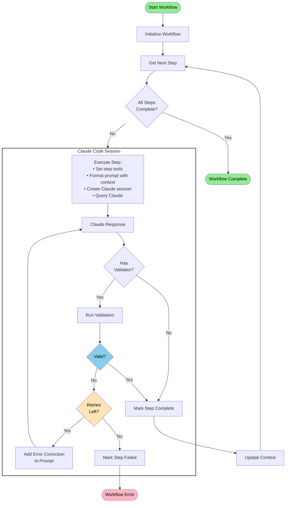
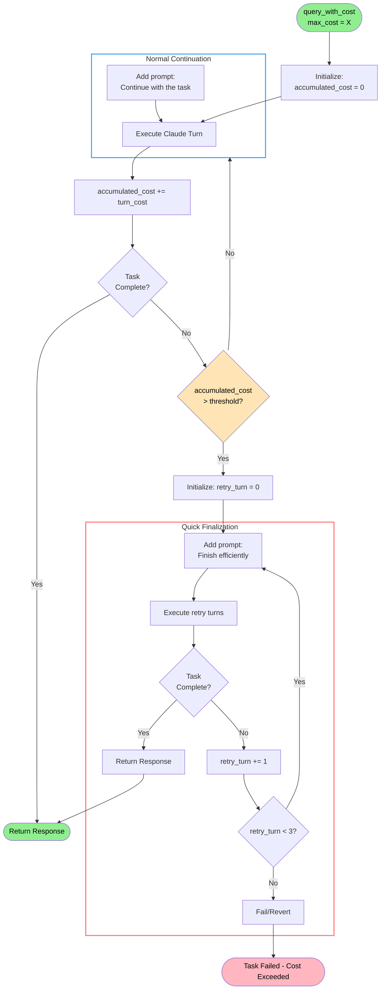

# Wake AI

AI-powered smart contract security analysis framework powered by Claude.

## Overview

Wake AI is a standalone Python framework for running AI-powered workflows on smart contract codebases. It provides a flexible architecture for creating custom AI workflows that can analyze, audit, and detect issues in Solidity smart contracts.

## Installation

### Using pip

```bash
pip install wake-ai
```

### From source

```bash
git clone https://github.com/Ackee-Blockchain/wake-ai
cd wake-ai
pip install -e .
```

### Development installation

```bash
# Clone the repository
git clone https://github.com/Ackee-Blockchain/wake-ai
cd wake-ai

# Create virtual environment
python -m venv venv
source venv/bin/activate  # On Windows: venv\Scripts\activate

# Install in development mode
pip install -e ".[dev]"
# or using requirements files
pip install -r requirements-dev.txt
```

## Quick Start

```bash
# Run security audit on your codebase
wake-ai audit

# Audit specific files
wake-ai audit -s contracts/Token.sol -s contracts/Vault.sol

# Export results to JSON
wake-ai audit --export results.json

# Resume a previous session
wake-ai --resume
```

## Architecture

Wake AI consists of two main components:

### 1. Core Framework (`wake_ai/`)

```
wake_ai/
├── __init__.py                 # Package initialization
├── core/                       # Core framework components
│   ├── claude.py              # Claude Code wrapper
│   ├── flow.py                # Base workflow infrastructure
│   ├── exceptions.py          # Framework exceptions
│   └── utils.py               # Framework utilities
├── detections.py              # Detection classes and utilities
├── results.py                 # Result system (AIResult, SimpleResult, etc.)
├── runner.py                  # Workflow execution helper
├── utils.py                   # Shared utilities
└── cli.py                     # CLI interface
```

### 2. Workflows (`flows/`)

```
flows/
├── audit/                      # Security audit workflow
│   ├── workflow.py            # AuditWorkflow implementation
│   └── prompts/               # Audit-specific prompts
│       ├── 0-initialize.md
│       ├── 1-analyze-and-plan.md
│       ├── 2-manual-review.md
│       └── 3-executive-summary.md
└── ...                         # More workflows
```

## Workflow Core Concepts

### Cladue Session and Workflow Management

Wake AI contains inteligent wrappers for Claude Code API.
This wrapper allows us to:

-   Continue `claude code` sessions inbetween steps
-   Set cost limits for each step, where the wrapper automatically loops through `claude code` execution in configurable increments of `n` turns, monitoring accumulated costs after each increment and prompting Claude to efficiently finish the task when the specified `max_cost_limit` threshold is approached
-   If a `validation` function is provided, the wrapper will automatically retry the step, prompting `claude code` to fix the errors returned by the `validation` function

### Working Directory

A key concept of Wake AI is the `working_dir` and `execution_dir`.
The `execution_dir` is the directory where the workflow is executed.
The `working_dir` is the directory where the `claude code` works in.

One of the main problems which needed to be resolved is how to pass context and results in between steps.
A straight forward solution is to simply use a working directory, serving as a shared scratchpad and results storage.
All steps within the workflow will have access to the working directory, and can read and write to it.
The working directory is also used to store the result of the workflow.

```
.wake/ai/<YYYYMMDD_HHMMSS_random>/
├── state/                 # Workflow state metadata
├── <ai-thoughts>.md       # Thoughts, or intermediate results can be stored in markdown files
└── <ai-results>.json      # Results can be stored in json files for easy parsing after the workflow is finished
```

#### Working Directory Cleanup

By default, workflows are configured to automatically clean up their working directories after successful completion. This behavior can be controlled at three levels:

1. **Workflow class default**: Set `cleanup_working_dir` class attribute (default: `False`)

    ```python
    class MyWorkflow(AIWorkflow):
        cleanup_working_dir = True  # This workflow cleans up by default
    ```

2. **Constructor override**: Pass `cleanup_working_dir` parameter when creating workflow instance

    ```python
    workflow = MyWorkflow(cleanup_working_dir=False)  # Keep working dir for this instance
    ```

3. **CLI override**: Use `--no-cleanup` or `--cleanup` flags
    ```bash
    wake-ai audit --no-cleanup  # Preserve working directory
    wake-ai example --cleanup   # Force cleanup even if workflow default is False
    ```

### Workflow Execution Flow

This diagram shows how workflows execute with multiple steps, validation, and retry logic:



### Max Cost Handling Flow

This diagram shows how `query_with_cost()` executes Claude in turns with cost monitoring:



## Flow Example: AIAuditWorkflow

The audit workflow demonstrates the full capabilities of the Wake AI framework:

### Step Details

1. **Analyze & Plan** (`max_cost: $10.0`)

    - Tools: read, search, write, grep, bash
    - Creates: `tracking.yaml`, `overview.md`
    - Validates: YAML structure, required sections

2. **Manual Review** (`max_cost: $50.0`)

    - Tools: read, write, search, grep, edit
    - Reviews: Each vulnerability in tracking
    - Creates: Issue files for confirmed findings (i.e. `issues/m1-reentrancy.yaml`)
    - Updates: Status (confirmed/false-positive)

3. **Executive Summary** (`max_cost: $10.0`)
    - Tools: read, write
    - Creates: Professional audit report
    - Includes: Statistics, findings, recommendations

### Usage Example

```bash
# Run a new audit
wake-ai audit -s contracts/Token.sol -s contracts/Vault.sol --model opus

# Resume a previous audit if it was interrupted
wake-ai audit --resume

# With specific focus areas
wake-ai audit -f reentrancy -f "access control" --model sonnet
```

### Implementation Example

Here's a simplified example of how the audit workflow is implemented:

```python
from wake_ai.core.flow import AIWorkflow, ClaudeCodeResponse
from typing import Tuple, List

class AuditWorkflow(AIWorkflow):
    """Security audit workflow following industry best practices."""

    name = "audit"
    allowed_tools = ["Read", "Grep", "Glob", "LS", "Task", "TodoWrite", "Write", "Edit", "MultiEdit"]

    def __init__(self, scope_files=None, context_docs=None, focus_areas=None, **kwargs):
        self.scope_files = scope_files or []
        self.context_docs = context_docs or []
        self.focus_areas = focus_areas or []

        # Load prompts from markdown files
        self._load_prompts()

        # Initialize parent class - this calls _setup_steps()
        super().__init__(name=self.name, **kwargs)

    def _setup_steps(self):
        """Define workflow steps with prompts, tools, and validators."""

        # Step 1: Analyze and Plan
        self.add_step(
            name="analyze_and_plan",
            prompt_template=self._build_prompt("analyze_and_plan"),
            tools=["Read", "Search", "Write", "Grep", "Bash"],
            max_cost=10.0,
            validator=self._validate_analyze_and_plan,
            max_retries=2
        )

        # Step 2: Manual Review
        self.add_step(
            name="manual_review",
            prompt_template=self._build_prompt("manual_review"),
            tools=["Read", "Write", "Search", "Grep", "Edit"],
            max_cost=10.0,
            validator=self._validate_manual_review,
            max_retries=2
        )


        # ... more steps ...

    def _validate_analyze_and_plan(self, response: ClaudeCodeResponse) -> Tuple[bool, List[str]]:
        """Validate that required files were created with correct structure."""
        errors = []
        audit_dir = Path(self.working_dir) / "audit"

        # Check for tracking.yaml
        tracking_file = audit_dir / "tracking.yaml"
        if not tracking_file.exists():
            errors.append(f"Tracking file not created at {tracking_file}")
        else:
            # Validate YAML structure
            with open(tracking_file, 'r') as f:
                data = yaml.safe_load(f)
                # Check required fields...

        return (len(errors) == 0, errors)

    # ... more validators ...


    @classmethod
    def get_cli_options(cls) -> Dict[str, Any]:
        """Return audit workflow CLI options."""
        import rich_click as click
        return {
            "scope": {
                "param_decls": ["-s", "--scope"],
                "multiple": True,
                "type": click.Path(exists=True),
                "help": "Files/directories in audit scope (default: entire codebase)"
            },
            "context": {
                "param_decls": ["-c", "--context"],
                "multiple": True,
                "type": click.Path(exists=True),
                "help": "Additional context files (docs, specs, etc.)"
            },
            "focus": {
                "param_decls": ["-f", "--focus"],
                "multiple": True,
                "help": "Focus areas (e.g., 'reentrancy', 'ERC20', 'access-control')"
            }
        }

    @classmethod
    def process_cli_args(cls, **kwargs) -> Dict[str, Any]:
        """Process CLI arguments for audit workflow."""
        return {
            "scope_files": list(kwargs.get("scope", [])),
            "context_docs": list(kwargs.get("context", [])),
            "focus_areas": list(kwargs.get("focus", []))
        }
```

## Flows Location

We can place AI flows into the:

1. `wake/ai/flows` folder
    - most straightforward option, but will require flows to be public so no
2. `wake_detectors` folder
    - private repo good
    - detectors have a quite limited output + auto-compile before by default
    - requires either updating the detector + its output classes or somehow mapping AI flow output to detector output (but then we are missing tructuring into description, epxloit, recommendation, etc.), too complex
3. `wake_printers` folder
    - private repo good
    - more flexible than detectors since we can print anything to output, but lacking export options
    - requires implementing export functionality
4. new `wake_ai` folder, analogous to `wake_detectors` or `wake_printers`
    - as flexible as we want
    - requires implementing fetching from private repo

### Structure

To keep AI flows as flexible as possible, we avoid limiting the output structure by implementing a base `AIResult` class that can be extended for specific result types.

The base `AIResult` class provides a foundation for any AI workflow result:

```python
class AIResult(ABC):
    """Base class for AI workflow results.

    Any result type that implements these methods can be used by the AI CLI.
    This allows each workflow to define its own result structure and formatting.
    """

    @classmethod
    @abstractmethod
    def from_working_dir(cls, working_dir: Path, raw_results: Dict[str, Any]) -> "AIResult":
        """Create a result instance by parsing the working directory.

        Args:
            working_dir: Path to the workflow's working directory
            raw_results: Raw results dict from workflow execution

        Returns:
            An instance of the result class with parsed data
        """
        ...

    @abstractmethod
    def pretty_print(self, console: "Console") -> None:
        """Print the result in a human-readable format to the console."""
        ...

    @abstractmethod
    def to_dict(self) -> Dict[str, Any]:
        """Convert the result to a dictionary for JSON serialization."""
        ...

    def export_json(self, path: Path) -> None:
        """Export the result to a JSON file.

        Default implementation uses to_dict(), but can be overridden
        for custom export formats.
        """
        data = self.to_dict()
        path.parent.mkdir(parents=True, exist_ok=True)
        path.write_text(json.dumps(data, indent=2))
```

By implementing the `from_working_dir()`, `to_dict()` and `pretty_print()` methods, results can be parsed from workflow outputs, exported to dictionaries and displayed in the console.

#### Example: Detection-Specific Result

Here's an example of a specialized result class for detection-style outputs:

```python

class AIDetectionResult(AIResult):
    """Detection result specifically for security audit workflows."""

    def __init__(self, detections: List[Tuple[str, AIDetection]], working_dir: Path):
        self.detections = detections
        self.working_dir = working_dir

    @classmethod
    def from_working_dir(cls, working_dir: Path, raw_results: Dict[str, Any]) -> "AIDetectionResult":
        """Parse audit workflow results from the working directory.

        Looks for the standard audit output structure and parses YAML/AsciiDoc files.
        """
        # Create instance first
        instance = cls([], working_dir)
        # Then parse detections using instance method
        instance.detections = instance.parse_audit_results(working_dir)
        return instance

    def parse_audit_results(self, working_dir: Path) -> List[Tuple[str, AIDetection]]:
        """Parse audit workflow results into AIDetection format.

        (Implementation details omitted for brevity)
        """
        # Parse YAML files, AsciiDoc files, etc.
        # Return list of (detector_name, AIDetection) tuples
        ...

    def pretty_print(self, console: "Console") -> None:
        """Print detections using the detection printer."""
        from .detections import print_ai_detection

        if self.detections:
            console.print(f"\n[bold]Found {len(self.detections)} detection(s):[/bold]")
            for detector_name, detection in self.detections:
                print_ai_detection(detector_name, detection, console)
        else:
            console.print(f"\n[yellow]No detections found[/yellow]")

        # Always show where full results are
        console.print(f"\n[dim]Full results available in:[/dim] {self.working_dir}")

    def to_dict(self) -> Dict[str, Any]:
        """Convert all detections to dictionary format."""
        return {
            "detections": [
                {
                    "detector": detector_name,
                    **detection.to_dict()
                }
                for detector_name, detection in self.detections
            ],
            "working_directory": str(self.working_dir),
            "total_detections": len(self.detections)
        }

    def export_json(self, path: Path) -> None:
        """Use the existing export function for detection consistency."""
        from .detections import export_ai_detections_json
        export_ai_detections_json(self.detections, path)
```

The core runner handles output by calling either `pretty_print()` or `to_dict()` based on whether the user wants console output or has specified the `--export` flag.

This flexible architecture allows us to define new result types (e.g., fuzzing results, optimization reports) that can have different output formats. For example, `wake ai fuzz` could return specialized fuzzing results with its own `FuzzingResult` class, and export functionality can be customized or disabled for specific result types.

## Todo

-   [x] Extract `core` into a separate module + repo
-   [x] Add auto remove working folder option (implemented with `cleanup_working_dir` flag)
-   [x] Implement pre/post step hooks for workflow customization
-   [ ] Sandbox Claude Code
-   [ ] Enable defining AI flows in `wake_ai` folder under private repo
-   [ ] Reach consensus on AI framework name
    -   **_Wai_** – "W(ake) AI"
    -   **_Trace_** – simple, clean, post-hoc or live path tracking; modern and very product-ready.
    -   **_Tasks_** - simple, could also be well marketed, i.e. we are introducing wake tasks
        -   alternatively we could just swap `wake ai` for `wake task`, looks nice
    -   **_Shikoro_** – "reasoning in motion"; also sounds a bit like a stylized Japanese name.
    -   **_Michi_** – philosophical, elegant, the Way (道); perfect for a framework guiding agents.
    -   **_Shikō_** – internal reasoning, decision-making; evokes the "mind" of the agent.
    -   **_Kōro_** – technical, directional, navigating dynamic environments; feels advanced and system-level.
    -   **_Sendō_** (先導) – "Guidance / Leading the way" Suggests an agent that leads or follows intelligently.
-   [x] Reach consensus on AI detector output structure
-   [x] Add SingleStep helper class for simple detectors (implemented as `MarkdownDetector`)
    -   [ ] Consider multi-step MarkdownDetector variant with shared session context
        -   Would allow breaking complex detectors into phases (e.g., understanding → analysis → verification)
        -   Requires modifying base workflow to reuse ClaudeCodeSession across steps
        -   However, a single well-crafted prompt often achieves similar results with less complexity
-   [ ] Standardize claude wrapper for possibly other AI providers
-   [x] Migrate to Jinja for prompt templating

### Output Formats

1. Pure YAML with structured content blocks

```yaml
- name: Reentrancy in approve()
- severity: high
- detection_type: vulnerability
- location:
    - file: contracts/Token.sol
    - lines: 42-47
    - function: approve
description:
  - type: text
    content: |
      The `approve()` function does not emit an Approval event.
  - type: code
    source: CatCoin.sol
    language: solidity
    linenums: "42-47"
    content: |
      function approve(...) { ... }
```

2. YAML with Markdown/ADOC (default, used by `MarkdownDetector`)

```yaml
- name: Reentrancy in approve()
- severity: high
- detection_type: vulnerability
- location:
    - file: contracts/Token.sol
    - lines: 42-47
    - function: approve
description: |
  The `approve()` function does not emit an Approval event.

  ``solidity [CatCoin.sol:42-47]
  function approve(...) { ... }
  ``
```

3. Multi-file Structure (YAML + Markdown/ADOC Files)

```
catcoin-missing-approval-event/
  ├── meta.yaml
  ├── description.adoc
  ├── exploit.adoc
  └── recommendation.adoc
```

## Notes

-   Steps can be dynamically added in between workflow steps by including a `after-step` hook
-   Sessions can be resumed in between sessions by using the `resume` flag, by default new ones are created
    -   This makes it possible to create different agents for each step, i.e. audit agent, validation agent, etc.
-   Detector currently returns empty `DetectorResult[]` (AI results in working directory). If AI returns results into a JSON file, the detector will return the file contents as a `DetectorResult`
-   Max costs can be exceeded in the current implementation and serve more like a guardrail than a hard limit.
    -   A potential solution could be to request the session to be finished quicker once we exceed a percentage (i.e. 80%) of the max cost limit
-   YAML files could be a good candidate for storing results, as they are human readable and can be easily parsed.
-   Sandboxing Claude Code is not implemented atm, but should be added before running on servers.

## Tools Configuration

Wake AI workflows can configure which tools Claude has access to. Tools are managed through the `allowed_tools` and `disallowed_tools` parameters.

### Tool Permission Modes

According to [Claude Code's IAM documentation](https://docs.anthropic.com/en/docs/claude-code/iam#permission-modes), tools fall into two categories:

**Tools requiring permission** (must be explicitly allowed):

-   `Bash` - Execute shell commands
-   `Edit` - Make targeted edits to files
-   `MultiEdit` - Perform multiple edits atomically
-   `Write` - Create or overwrite files
-   `NotebookEdit` - Modify Jupyter notebooks
-   `WebFetch` - Fetch content from URLs
-   `WebSearch` - Perform web searches

**Tools not requiring permission** (always available unless explicitly disallowed):

-   `Read` - Read file contents
-   `Grep` - Search patterns in files
-   `Glob` - Find files by pattern
-   `LS` - List directories
-   `Task` - Run sub-agents
-   `TodoWrite` - Manage task lists
-   `NotebookRead` - Read Jupyter notebooks

### Restricting Bash Commands

The Bash tool can be restricted to specific commands using parentheses syntax:

```python
# Allow only git commands
allowed_tools = ["Read", "Write", "Bash(git *)"]

# Allow only specific commands
allowed_tools = ["Read", "Write", "Bash(npm install)", "Bash(npm test)"]

# Multiple command patterns
allowed_tools = ["Read", "Write", "Bash(git *)", "Bash(npm *)", "Bash(wake *)"]
```

### Example: Workflow with Restricted Tools

```python
class MyWorkflow(AIWorkflow):
    # Default tools for all steps
    allowed_tools = ["Read", "Write", "Grep", "Bash(wake *)"]

    def _setup_steps(self):
        # Step with custom tools
        self.add_step(
            name="analyze",
            prompt_template="...",
            tools=["Read", "Grep", "Bash(wake detect *)", "Write"],
            max_cost=5.0
        )
```

## Creating Custom Detectors

Wake AI provides a `MarkdownDetector` template that makes it easy to create custom security detectors. You only need to define what to look for - the framework handles everything else.

### Quick Example: Uniswap Detector

```python
from wake_ai.templates import MarkdownDetector

class UniswapDetector(MarkdownDetector):
    """Detector for Uniswap-specific vulnerabilities."""

    name = "uniswap"

    def get_detector_prompt(self) -> str:
        """Define what vulnerabilities to detect."""
        return """
        Analyze this codebase for Uniswap integration vulnerabilities.

        Check for:
        1. Incorrect reserve usage (token0/token1 order)
        2. Missing slippage protection in swaps
        3. Price oracle manipulation risks
        4. Flash loan callback vulnerabilities
        5. Hardcoded router/factory addresses

        For each issue found, provide:
        - Clear explanation of the vulnerability
        - Severity assessment (critical/high/medium/low)
        - Recommended fix with code example
        """
```

### Using Your Detector

```bash
# Run via CLI
wake-ai uniswap

# Export results
wake-ai uniswap --export uniswap-findings.json
```

The detector automatically outputs findings to a structured `results.yaml` format that integrates with Wake AI's detection system. Results are parsed into `AIDetection` objects with proper formatting and export capabilities.

See the [Uniswap detector implementation](flows/uniswap_detector/workflow.py) for a comprehensive example with CLI options and configuration.

### Example: Reentrancy Detector

The reentrancy detector demonstrates how to combine Wake's built-in static analysis with AI-powered verification:

```python
from wake_ai.templates import MarkdownDetector

class ReentrancyDetector(MarkdownDetector):
    """Enhanced reentrancy detector leveraging Wake's static analysis."""

    name = "reentrancy"

    def get_detector_prompt(self) -> str:
        return """# Reentrancy Vulnerability Analysis

<task>
Perform comprehensive reentrancy analysis by combining Wake's static analysis with manual verification
</task>

<steps>
1. **Initialize Wake and run built-in detection**
   - Run: wake init
   - Run: wake detect reentrancy
   - Parse Wake's findings as baseline

2. **Manual verification of each finding**
   - Analyze complete function context
   - Trace call flows and state changes
   - Verify actual exploitability

3. **Identify additional patterns**
   - Cross-function reentrancy
   - Read-only reentrancy
   - ERC777/1155 callback vulnerabilities
</steps>
"""
```

This detector leverages Wake's powerful static analysis as a starting point, then uses AI to eliminate false positives and identify complex patterns that static analysis might miss.

## Examples

The `examples/` directory contains examples demonstrating various Wake AI features and patterns:

### Security Detector Example: Reentrancy

The [reentrancy example](examples/reentrancy/) demonstrates how to build a security detector using the `MarkdownDetector` template, which:

-   Integrates with Wake's built-in static analysis tools
-   Performs AI-powered verification to eliminate false positives
-   Follows structured prompt patterns for consistent results
-   Outputs findings in Wake AI's standard detection format

### Workflow Hooks Example

The [hooks example](examples/hooks/) shows how to use workflow-level hooks for:

-   Logging and monitoring step execution
-   Collecting performance metrics
-   Dynamically modifying context between steps
-   Creating custom telemetry and debugging tools

See the [examples README](examples/README.md) for a complete guide to all examples.

## Requirements

-   Python 3.8 or higher
-   Claude Code CLI (`claude-code`) installed and authenticated
-   Valid Claude API access

### Claude Code Setup

Wake AI requires Claude Code CLI to be installed and authenticated:

```bash
# Install Claude Code (if not already installed)
pip install claude-code

# Authenticate with your API key
claude-code auth
```

## Prompt Writing Guidelines

When creating Wake AI workflows, follow the structured prompt design patterns documented in `prompt-writing.mdc`. Key elements include:

-   **Task-First Architecture**: Start with a clear `<task>` declaration
-   **Structured Sections**: Use `<context>`, `<steps>`, `<validation_requirements>`, and `<output_format>`
-   **Progressive Refinement**: Follow the Discovery → Analysis → Documentation pattern
-   **Explicit Examples**: Include complete YAML/code examples in output specifications

See existing workflows in `flows/` for reference implementations.
