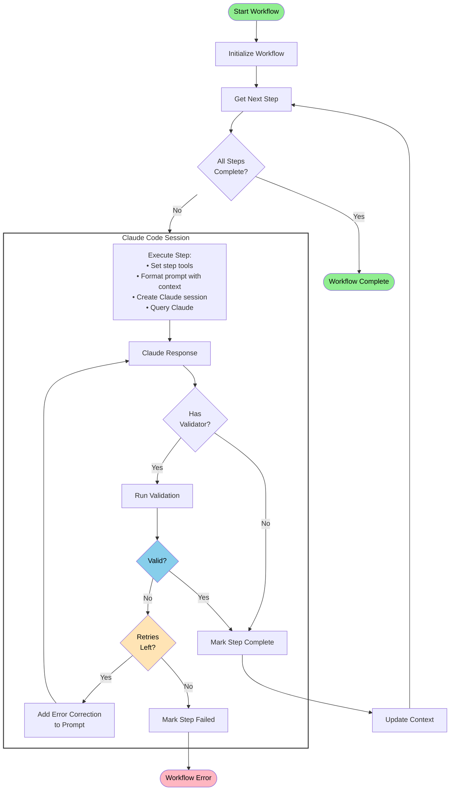
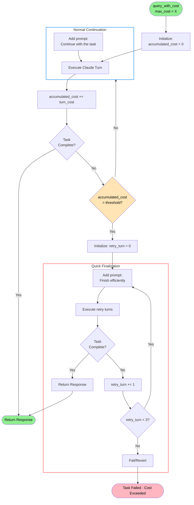

# Wake AI Documentation

## Table of Contents

-   [Introduction](#introduction)
-   [Installation](#installation)
-   [Getting Started](#getting-started)
-   [Core Concepts](#core-concepts)
    -   [Workflows](#workflows)
    -   [Steps](#steps)
    -   [Context](#context)
    -   [Working Directory vs Execution Directory](#working-directory-vs-execution-directory)
    -   [Validation](#validation)
    -   [Claude Session Management](#claude-session-management)
    -   [Workflow Execution Flow](#workflow-execution-flow)
-   [Creating Workflows](#creating-workflows)
    -   [AI-Assisted Workflow Generation](#ai-assisted-workflow-generation)
    -   [Multi-Step Workflow Example](#multi-step-workflow-example)
    -   [Adding CLI Options](#adding-cli-options)
-   [Advanced Features](#advanced-features)
    -   [Dynamic Step Generation](#dynamic-step-generation)
    -   [Conditional Step Execution](#conditional-step-execution)
    -   [Structured Data Extraction](#structured-data-extraction)
    -   [Cost Management](#cost-management)
    -   [Progress Tracking](#progress-tracking)
    -   [Session Management](#session-management)
    -   [Technical Notes](#technical-notes)
-   [Tools Configuration](#tools-configuration)
    -   [Tool Permission Modes](#tool-permission-modes)
    -   [Restricting Bash Commands](#restricting-bash-commands)
-   [Result System Architecture](#result-system-architecture)
-   [Examples](#examples)
-   [API Reference](#api-reference)
-   [Best Practices](#best-practices)
    -   [Prompt Design](#prompt-design)
    -   [Cost Optimization](#cost-optimization)
    -   [Error Handling](#error-handling)
    -   [Output and Storage](#output-and-storage)
    -   [Security](#security)

## Introduction

Wake AI is a framework for building AI-powered workflows to analyze smart contracts. It wraps Claude's capabilities in a structured workflow engine that provides cost control, validation, retry logic, and session management.

### Key Features

-   **Workflow Engine**: Chain multiple AI steps with context passing
-   **Cost Management**: Set per-step cost limits to control spending
-   **Validation & Retry**: Automatic validation with configurable retries
-   **Session Persistence**: Resume workflows from where they left off
-   **Progress Tracking**: Visual progress bars with Rich integration and external hooks
-   **Tool Control**: Fine-grained control over which tools Claude can use
-   **Working Directory**: Isolated workspace for each workflow run

## Installation

### Requirements

-   Python 3.8+
-   Claude Code CLI installed and authenticated

### Install from PyPI

```bash
pip install wake-ai
```

### Install from Source

```bash
git clone https://github.com/Ackee-Blockchain/wake-ai
cd wake-ai
pip install -e .
```

### Claude Code Setup

Wake AI requires Claude Code CLI:

```bash
# Install Claude Code
pip install claude-code

# Authenticate
claude-code auth
```

## Getting Started

### Running Pre-built Workflows

Wake AI comes with ready-to-use workflows:

// todo: update when exampels will be updated

```bash
# Run comprehensive security audit
wake-ai audit

# Detect Uniswap-specific vulnerabilities
wake-ai uniswap

# Specify files to analyze
wake-ai audit -s contracts/Token.sol -s contracts/Vault.sol

# Export results
wake-ai audit --export results.json

# Resume interrupted workflow
wake-ai --resume
```

### Creating a Simple Detector

The easiest way to create a custom detector is using the `SimpleDetector` template:

```python
import rich_click as click
from wake_ai.templates import SimpleDetector
from wake_ai import workflow

@workflow.command("access-control")
@click.option("--scope", "-s", multiple=True, type=click.Path(exists=True), help="Files to analyze")
def factory(scope):
    """Detect access control vulnerabilities in smart contracts."""
    detector = AccessControlDetector()
    detector.scope = list(scope)
    return detector

class AccessControlDetector(SimpleDetector):
    """Detect access control vulnerabilities."""

    scope: list = []

    def get_detector_prompt(self) -> str:
        return """
        Analyze this codebase for access control vulnerabilities.

        Check for:
        1. Missing access modifiers (onlyOwner, etc.)
        2. Incorrect permission checks
        3. Centralization risks
        4. Privilege escalation paths

        For each issue found, provide:
        - Clear explanation
        - Severity (critical/high/medium/low)
        - Recommended fix with code
        """
```

Register and run:

```bash
wake-ai access-control
```

## Core Concepts

### Workflows

A workflow is a sequence of AI-powered steps that execute in order. Each workflow:

-   Has a unique working directory (`.wake/ai/<session-id>/`)
-   Maintains context between steps
-   Can be resumed if interrupted
-   Tracks costs and validates outputs

### Steps

Each step in a workflow:

-   Has a prompt template (using Jinja2)
-   Can specify allowed/disallowed tools
-   Has optional validation logic
-   Can retry on failure
-   Updates the workflow context
-   Executes sequentially (parallel execution not currently supported)

### Context

Context is how data flows between steps:

-   Each step can access all previous outputs
-   Special variables: `{{working_dir}}`, `{{execution_dir}}`
-   Step outputs available as `{{step_name}_output}}`
-   Custom context via `add_context()`

### Working Directory vs Execution Directory

Wake AI distinguishes between two key directories:

-   **Execution Directory** (`{{execution_dir}}`): The directory where the workflow is launched from
-   **Working Directory** (`{{working_dir}}`): An isolated directory created for each workflow session at `.wake/ai/<session-id>/`

The working directory serves as a shared scratchpad and results storage between steps. All steps within a workflow have access to this directory for reading and writing files, making it the primary mechanism for passing data between steps.

### Validation

Steps can have validators that ensure output quality:

-   Return `(success: bool, errors: List[str])`
-   Failed validation triggers retry with error feedback
-   Maximum retry attempts configurable per step

### Claude Session Management

Wake AI contains intelligent wrappers for the Claude Code API that provide:

-   **Session Continuity**: Continue `claude code` sessions between steps
-   **Cost Control**: Set cost limits for each step, where the wrapper automatically loops through `claude code` execution in configurable increments, monitoring accumulated costs after each increment
-   **Smart Cost Management**: When approaching the specified `max_cost_limit` threshold, the wrapper prompts Claude to efficiently finish the task
-   **Automatic Validation**: If a validation function is provided, the wrapper automatically retries the step, prompting `claude code` to fix errors returned by the validation function

### Workflow Execution Flow

This diagram shows how workflows execute with multiple steps, validation, and retry logic:



## Creating Workflows

### AI-Assisted Workflow Generation

Wake AI includes powerful prompt templates in the `/prompts` folder that help with workflow development:

**Available Prompts**:

-   `prompts/wake-ai-flow-generation.md` - Generate new workflows from your ideas
-   Additional prompts for guidelines on prompt writing and creating flows using AI

The workflow generation prompt helps you:

-   Transform security analysis ideas into working detectors
-   Create multi-step audit workflows with proper validation
-   Generate CLI-ready workflows with all required components
-   Follow Wake AI coding patterns and conventions

Example usage:

```bash
# Use the prompt with your favorite AI to generate a new workflow
# Then save the generated code to flows/my_detector/workflow.py
```

The prompt handles:

-   Choosing between `SimpleDetector` or `AIWorkflow` (complex)
-   Setting up steps with appropriate tools and validators
-   Creating CLI options and argument processing
-   Implementing proper error handling and validation
-   Following Wake AI's structured prompt patterns

### Multi-Step Workflow Example

```python
import rich_click as click
from wake_ai import AIWorkflow, WorkflowStep, workflow
from wake_ai.core.utils import validate_yaml_output

@workflow.command("test-gen")
@click.option("--framework", "-f", type=click.Choice(["foundry", "hardhat"]), default="foundry", help="Test framework to use")
def factory(framework):
    """Generate comprehensive test suites for smart contracts."""
    workflow = TestGeneratorWorkflow()
    workflow.framework = framework
    return workflow

class TestGeneratorWorkflow(AIWorkflow):
    """Generate comprehensive test suites."""

    framework: str

    def _setup_steps(self):
        # Step 1: Analyze contract structure
        self.add_step(
            name="analyze",
            prompt_template="""Analyze the smart contract structure.

            Working directory: {{working_dir}}

            Tasks:
            1. Identify all functions and their purposes
            2. Find state variables and invariants
            3. Detect external dependencies

            Create a file 'analysis.md' with your findings.
            """,
            allowed_tools=["Read", "Grep", "Write"],
            max_cost=5.0
        )

        # Step 2: Identify test scenarios (continues session)
        self.add_step(
            name="scenarios",
            prompt_template="""Based on the functions and invariants you just analyzed,
            identify critical test scenarios. Focus on:
            - Edge cases for each function you found
            - Invariant violations you identified
            - Attack vectors specific to the contract logic

            Add these scenarios to 'test-scenarios.md'.
            """,
            allowed_tools=["Write"],
            max_cost=3.0,
            continue_session=True  # Needs memory of specific functions found
        )

        # Step 3: Generate test plan (new session for structured output)
        self.add_step(
            name="plan",
            prompt_template="""Review the analysis and scenarios:
            - {{working_dir}}/analysis.md
            - {{working_dir}}/test-scenarios.md

            Create a structured test plan in YAML format in the {{working_dir}}/test-plan.yaml file.
            """,
            allowed_tools=["Read", "Write"],
            validator=validate_yaml_output,
            max_cost=5.0,
            continue_session=False  # Fresh session for clean YAML generation
        )
```

### Adding CLI Options

CLI options are added using click decorators on the factory function:

```python
@workflow.command("test-gen")
@click.option("--framework", "-f", type=click.Choice(["foundry", "hardhat"]), default="foundry", help="Test framework to use")
@click.option("--scope", "-s", multiple=True, type=click.Path(exists=True), help="Files to analyze")
def factory(framework, scope):
    """Generate comprehensive test suites for smart contracts."""
    workflow = TestGeneratorWorkflow()
    workflow.framework = framework
    workflow.scope = list(scope)
    return workflow
```

## Advanced Features

### Dynamic Step Generation

Generate steps at runtime based on analysis results:

```python
def _setup_steps(self):
    # Initial analysis step
    self.add_step(
        name="scan",
        prompt_template="Scan for all Solidity files...",
        tools=["Glob", "Read"]
    )

    # Generate steps based on findings
    def generate_review_steps(response, context):
        files = parse_file_list(self.get_context("scan_output"))
        steps = []

        for file in files:
            steps.append(WorkflowStep(
                name=f"review_{file.name}",
                prompt_template=f"Review {file.path} for vulnerabilities...",
                tools=["Read", "Write"],
                max_cost=2.0
            ))

        return steps

    self.add_dynamic_steps(
        name="file_reviews",
        generator=generate_review_steps,
        after_step="scan"
    )
```

### Conditional Step Execution

Skip steps based on runtime conditions:

```python
self.add_step(
    name="deep_analysis",
    prompt_template="Perform deep vulnerability analysis...",
    condition=lambda ctx: ctx.get("vulnerabilities_found", 0) > 0,
    max_cost=20.0
)
```

### Structured Data Extraction

Beyond parsing data from the working directory, you can use `add_extraction_step()` to extract structured objects directly from previous step responses. The AI returns structured data that's automatically parsed and added to context.

```python
from pydantic import BaseModel

class VulnerabilityReport(BaseModel):
    title: str
    severity: str
    description: str
    recommendation: str

# Add extraction after analysis step
self.add_extraction_step(
    after_step="analyze",
    output_schema=VulnerabilityReport,
    context_key="vulnerability_data"
)

# Access in next step
self.add_step(
    name="report",
    prompt_template="""
    Generate report for: {{vulnerability_data.title}}
    Severity: {{vulnerability_data.severity}}
    """
)
```

### Cost Management

Control API costs with intelligent limits:

```python
# Step with cost limit
self.add_step(
    name="expensive_analysis",
    prompt_template="...",
    max_cost=10.0,        # Initial attempt limit
    max_retry_cost=2.0    # Retry attempt limit
)
```

The cost manager:

-   Monitors costs in increments
-   Prompts Claude to finish efficiently when approaching limit
-   Supports different limits for initial vs retry attempts

#### Max Cost Handling Flow

This diagram shows how `query_with_cost()` executes Claude in turns with cost monitoring:



### Progress Tracking

Wake AI provides comprehensive progress tracking with visual Rich progress bars and external integration hooks for long-running workflows.

#### Basic Progress Tracking

Progress tracking is enabled by default and shows:
- Beautiful Rich progress bars with percentage completion
- Status messages for each step and operation
- Time remaining estimation
- Step execution feedback

```bash
# Progress bar shown by default
wake-ai audit

# Disable progress bar (useful for CI/CD)
wake-ai --no-progress audit
```

#### External Progress Hooks

Integrate progress tracking with external applications using progress hooks:

```python
def my_progress_callback(percentage: float, message: str):
    """Called whenever progress updates."""
    print(f"App Progress: {percentage*100:.1f}% - {message}")

    # Update your app's UI, database, etc.
    update_ui_progress_bar(percentage)
    log_workflow_progress(percentage, message)

# Set the hook before execution
workflow = AuditWorkflow()
workflow.set_progress_hook(my_progress_callback)
results = workflow.execute()
```

#### Programmatic Progress Updates

For custom workflows, you can manually control progress:

```python
class CustomWorkflow(AIWorkflow):
    def _setup_steps(self):
        # Define your steps...
        pass

    def _post_step_hook(self, step, response):
        """Called after each step completion."""
        # Custom progress message
        if step.name == "analysis":
            self.update_progress_message(f"Analysis complete, found {self.vulnerability_count} issues")
        elif step.name == "validation":
            self.update_progress_message("Validation passed, generating report...")

        super()._post_step_hook(step, response)

    def custom_operation(self):
        """Example of manual progress updates."""
        # Update message without changing percentage
        self.update_progress_message("Processing custom operation...")

        # Force specific percentage (rarely needed)
        self.update_progress("Custom milestone reached", force_percentage=0.5)
```

#### CLI Options

Control progress behavior from the command line:

```bash
# Default - show progress bar
wake-ai audit

# Disable progress (useful for scripting/CI)
wake-ai --no-progress audit
```

#### Technical Implementation

Progress tracking uses:
- **Rich library** for beautiful terminal progress bars
- **Weighted step calculation** for accurate percentages
- **State persistence** for resume capability
- **Hook system** for external integration
- **Message-only updates** during retries and validation

The implementation ensures progress only moves forward when steps complete, providing a smooth and predictable user experience while still showing detailed status information during step execution.

### Session Management

Control session behavior:

```python
# Step 1: Identify vulnerable patterns (new session - default)
self.add_step(
    name="identify",
    prompt_template="Search for reentrancy vulnerabilities in this codebase...",
    continue_session=False  # Start fresh session (default)
)

# Step 2: Generate fixes for found issues (continues session)
self.add_step(
    name="fix",
    prompt_template="For each reentrancy issue you just found, generate a secure fix...",
    continue_session=True  # Needs to know what issues were found
)

# Python usage for programmatic access - construct manually
workflow = MyWorkflow()
workflow.scope = ["contract.sol"]
workflow.custom_param = True
# Working directory and cleanup are handled automatically
results, formatted = workflow.execute()
```

**Multi-Agent Execution**: By default, each step creates a new agent session (`continue_session=False`), enabling multi-agent workflows with specialized agents. To maintain context within the same agent session, explicitly set `continue_session=True`.

**Note**: Steps execute sequentially. Wake AI does not currently support parallel step execution.

### Technical Notes

-   **Dynamic Step Addition**: Steps can be dynamically added between workflow steps using the `after-step` hook
-   **Session Resumption**: Sessions can be resumed between runs using the `resume` flag, enabling different agents for each step
-   **Cost Limits as Guardrails**: Max costs serve as guardrails rather than hard limits - costs may slightly exceed the limit when finishing the current operation
-   **YAML for Storage**: YAML files are recommended for storing results as they are human-readable and easily parsed
-   **Sandboxing**: Sandboxing Claude Code should be considered when running with high tool privileges

## Tools Configuration

Wake AI workflows can configure which tools Claude has access to. Tools are managed through the `allowed_tools` and `disallowed_tools` parameters.

### Tool Permission Modes

According to [Claude Code's IAM documentation](https://docs.anthropic.com/en/docs/claude-code/iam#permission-modes), tools fall into two categories:

**Tools requiring permission** (must be explicitly allowed):

-   `Bash` - Execute shell commands
-   `Edit` - Make targeted edits to files
-   `MultiEdit` - Perform multiple edits atomically
-   `Write` - Create or overwrite files
-   `NotebookEdit` - Modify Jupyter notebooks
-   `WebFetch` - Fetch content from URLs
-   `WebSearch` - Perform web searches

**Tools not requiring permission** (always available unless explicitly disallowed):

-   `Read` - Read file contents
-   `Grep` - Search patterns in files
-   `Glob` - Find files by pattern
-   `LS` - List directories
-   `Task` - Run sub-agents
-   `TodoWrite` - Manage task lists
-   `NotebookRead` - Read Jupyter notebooks

### Restricting Bash Commands

The Bash tool can be restricted to specific commands using parentheses syntax:

```python
# Allow only git commands
allowed_tools = ["Read", "Write", "Bash(git *)"]

# Allow only specific commands
allowed_tools = ["Read", "Write", "Bash(npm install)", "Bash(npm test)"]

# Multiple command patterns
allowed_tools = ["Read", "Write", "Bash(git *)", "Bash(npm *)", "Bash(wake *)"]
```

## Result System Architecture

Wake AI provides a unified result system that enables consistent output handling across different workflow types. The core is the `AIResult` base class that all workflow results extend:

```python
class AIResult(ABC):
    @abstractmethod
    def pretty_print(self, console: "Console") -> None:
        """Print the result in a human-readable format to the console."""

    @abstractmethod
    def to_dict(self) -> Dict[str, Any]:
        """Convert the result to a dictionary for JSON serialization."""
```

This architecture enables:

-   **Consistent CLI Output**: All workflows can display formatted results via `pretty_print()`
-   **JSON Export**: Results can be exported to JSON for further processing via `to_dict()`
-   **Extensible Design**: Each workflow can define custom result types with specific formatting

For example, `AIDetectionResult` extends this base class to provide security-specific formatting for vulnerability findings, allowing both human-readable console output and structured JSON export.

## Examples

The `examples/` directory contains working examples:

### Basic Examples

-   **[reentrancy](examples/reentrancy/)** - Security detector with Wake integration
-   **[reentrancy_test](examples/reentrancy_test/)** - Test generation workflow

### Advanced Examples

-   **[hooks](examples/hooks/)** - Workflow customization with pre/post hooks
-   **[conditional_test](examples/conditional_test/)** - Conditional step execution
-   **[dynamic_steps](examples/dynamic_steps/)** - Runtime step generation
-   **[extraction_step](examples/extraction_step/)** - Structured data extraction

Each example includes its own README with detailed explanations.

## Best Practices

### Prompt Design

1. **Be Specific**: Clear instructions produce better results
2. **Use Structure**: Break complex tasks into numbered steps
3. **Provide Examples**: Show expected output format
4. **Include Validation**: Specify what makes output valid

### Cost Optimization

1. **Set Reasonable Limits**: Start small, increase as needed
2. **Use Step Conditions**: Skip expensive steps when possible
3. **Validate Early**: Catch errors before expensive operations
4. **Reuse Sessions**: Use `continue_session` for related tasks

### Error Handling

1. **Add Validators**: Ensure output quality
2. **Set Retry Limits**: Balance quality vs cost
3. **Log Progress**: Use working directory for debugging
4. **Handle Interruptions**: Design for resumability

### Output and Storage

1. **Use YAML for Results**: YAML files are ideal for intermediate results and AI outputs - they're human-readable, easy to parse, and easy for AI to write correctly
2. **Structure Working Directory**: Organize outputs in the working directory for easy access
3. **Validate Outputs**: Use validators to ensure YAML/JSON outputs are well-formed

### Security

1. **Limit Tools**: Only allow necessary tools
2. **Sandbox Execution**: Run in isolated environments
